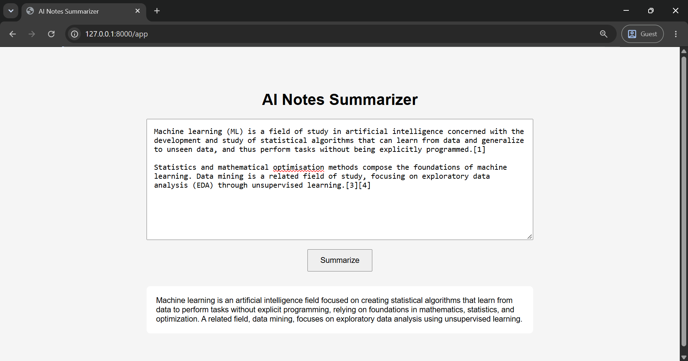

# AI Notes Summarizer

A simple AI-powered web application that I built to practice full-stack development with Python, FastAPI, Gemini, SQLite and Docker.

The application takes notes from the user and generates a short summary using the Google Gemini API. The generated summaries are also stored in a local SQLite database.

## Demo

## What it does

- Enter or paste notes into the web page
- Generate a short summary using Gemini
- Save generated summaries in SQLite
- View previously generated summaries through the history API
- Run the application locally or using Docker
- View and test the API using Swagger

## Tech Used

- Python
- FastAPI
- Google Gemini API
- HTML
- CSS
- JavaScript
- SQLite
- Docker
- Git

## How it works

The basic flow is:

User enters notes
       ↓
Frontend sends the notes to FastAPI
       ↓
FastAPI sends the text to Gemini
       ↓
Gemini generates the summary
       ↓
FastAPI saves the summary in SQLite
       ↓
Summary is returned to the frontend

## Project Structure

ai-notes-summarizer/
├── main.py
├── static/
│   └── index.html
├── requirements.txt
├── Dockerfile
├── .dockerignore
├── .env.example
├── .gitignore
└── README.md

The SQLite database is created locally when the application is used and is not included in the Git repository.

## Running the Project Locally

### 1. Clone the repository

git clone https://github.com/abhiram-labs/ai-notes-summarizer.git
cd ai-notes-summarizer

### 2. Create a virtual environment

python3 -m venv .venv

Activate it:

source .venv/bin/activate

### 3. Install the dependencies

pip install -r requirements.txt

### 4. Add the Gemini API key

Create a `.env` file in the project folder:

GEMINI_API_KEY=your_api_key_here

The `.env` file is ignored by Git and should not be uploaded to GitHub.

### 5. Start the application

uvicorn main:app --reload

Open the application:

http://127.0.0.1:8000/app

Swagger API documentation:

http://127.0.0.1:8000/docs

## API Endpoints

| Method | Endpoint | Purpose |
|---|---|---|
| GET | `/` | Basic API response |
| GET | `/app` | Opens the web application |
| POST | `/summarize` | Generates an AI summary |
| GET | `/history` | Returns saved summaries |
| GET | `/docs` | Swagger API documentation |

## Docker

Build the Docker image:

docker build -t ai-notes-summarizer .

Run the container:

docker run --env-file .env -p 8000:8080 ai-notes-summarizer

Then open:

http://127.0.0.1:8000/app

## Environment Variable

The application needs one environment variable:

GEMINI_API_KEY=

There is an `.env.example` file in the repository that can be used as a template.

## What I Learned From This Project

I built this project to get more practical experience with backend and AI application development.

Some of the things I worked with were:

- Creating REST APIs with FastAPI
- Using Pydantic to validate API requests
- Connecting a Python application to the Gemini API
- Using JavaScript fetch() to communicate with a backend API
- Storing data using SQLite
- Managing API keys using environment variables
- Creating and running Docker containers
- Using Git to manage the development stages of the project

## Possible Improvements

Some things I would like to add later:

- Improve the frontend design
- Add better loading and error messages
- Display the summary history directly on the webpage
- Add the ability to delete old summaries
- Deploy the application
- Add authentication

## Author

Abhiram AS
